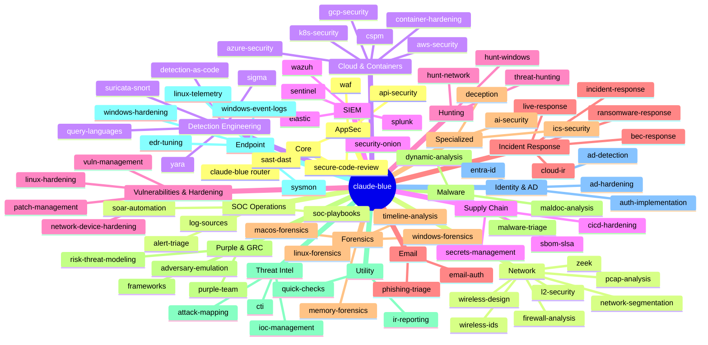
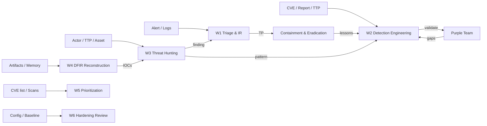

# claude-blue Mind Map

```mermaid
mindmap
  root((claude-blue))
    Core
      claude-blue router
    SOC Operations
      alert-triage
      log-sources
      soc-playbooks
      soar-automation
    Detection Engineering
      sigma
      yara
      suricata-snort
      query-languages
      detection-as-code
    SIEM
      wazuh
      elastic
      splunk
      sentinel
      security-onion
    Hunting
      threat-hunting
      hunt-windows
      hunt-network
    Incident Response
      incident-response
      live-response
      ransomware-response
      bec-response
      cloud-ir
    Forensics
      windows-forensics
      linux-forensics
      macos-forensics
      memory-forensics
      timeline-analysis
    Malware
      malware-triage
      dynamic-analysis
      maldoc-analysis
    Threat Intel
      cti
      attack-mapping
      ioc-management
    Endpoint
      windows-event-logs
      sysmon
      linux-telemetry
      edr-tuning
      windows-hardening
    Identity & AD
      ad-hardening
      ad-detection
      entra-id
      auth-implementation
    AppSec
      secure-code-review
      waf
      api-security
      sast-dast
    Network
      zeek
      pcap-analysis
      firewall-analysis
      network-segmentation
      l2-security
      wireless-ids
      wireless-design
    Cloud & Containers
      aws-security
      azure-security
      gcp-security
      cspm
      container-hardening
      k8s-security
    Supply Chain
      cicd-hardening
      secrets-management
      sbom-slsa
    Vulnerabilities & Hardening
      vuln-management
      patch-management
      linux-hardening
      network-device-hardening
    Email
      email-auth
      phishing-triage
    Specialized
      deception
      ics-security
      ai-security
    Purple & GRC
      purple-team
      adversary-emulation
      frameworks
      risk-threat-modeling
    Utility
      ir-reporting
      quick-checks
```

## Workflow Map

```mermaid
flowchart LR
    A[Alert / Logs] --> W1[W1 Triage & IR]
    B[CVE / Report / TTP] --> W2[W2 Detection Engineering]
    C[Actor / TTP / Asset] --> W3[W3 Threat Hunting]
    D[Artifacts / Memory] --> W4[W4 DFIR Reconstruction]
    E[CVE list / Scans] --> W5[W5 Prioritization]
    F[Config / Baseline] --> W6[W6 Hardening Review]
    W1 -->|TP| IR[Containment & Eradication]
    W3 -->|finding| W1
    W3 -->|pattern| W2
    W4 -->|IOCs| W3
    IR -->|lessons| W2
    W2 -->|validate| PT[Purple Team]
    PT -->|gaps| W2
```
